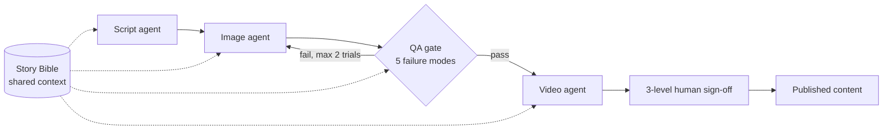

# 🎬 AI Avatar Content Engine

A guardrailed, four-agent AI pipeline built for a real estate client whose content output was bound to a physical shoot: a ~4-week shoot-to-post cycle, one crew, one city. The engine decouples output from the shoot by orchestrating script, image, QA and video agents end-to-end, so more content no longer means more crew days.

**The hard problem was consistency, not generation.** Across agents, context drifted: a character, setting or tone established in the script quietly changed by the time it reached image and video. The fix is a persistent **Story Bible**, a shared source of truth that every agent reads from, so each stage builds on the same facts instead of re-interpreting them.

**Status:** in staged trial.

**Guardrails, set before build, not after**

- **Quality bar:** 5 failure modes defined explicitly, each checked at the QA gate, not one blended "looks good" score
- **Cost cap:** a hard limit of 2 trials per scene, so a failing scene escalates instead of burning spend
- **Human control:** 3 levels of human sign-off before anything ships

`Agentic AI` `Multi-Agent Pipeline` `AI Guardrails` `Context Management`

---

*Case study — problem framing, architecture and guardrail design for an applied AI system. Built through NC Labs. No proprietary code or client data.*
